#  implementing a simple Book Register web form using MEAN stack
## INSTALL NODEJS

Node.js is a JavaScript runtime built on Chrome’s V8 JavaScript engine. Node.js is used in this tutorial to set up the Express routes and AngularJS controllers.

update ubuntu

`sudo apt update`

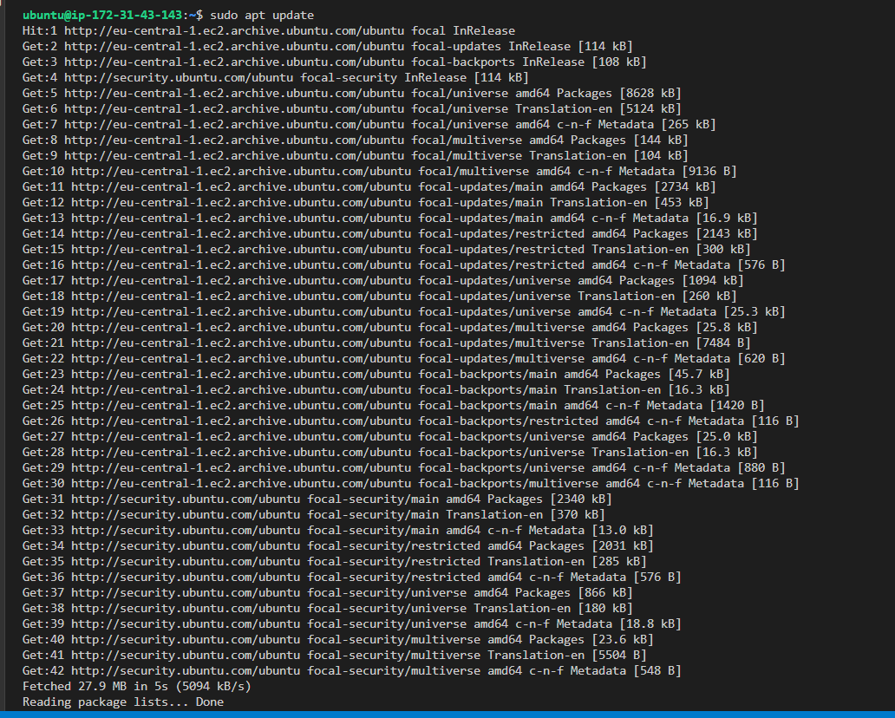

upgrade ubuntu

`sudo apt upgrade -y`

Add certificates

`sudo apt -y install curl dirmngr apt-transport-https lsb-release ca-certificates`

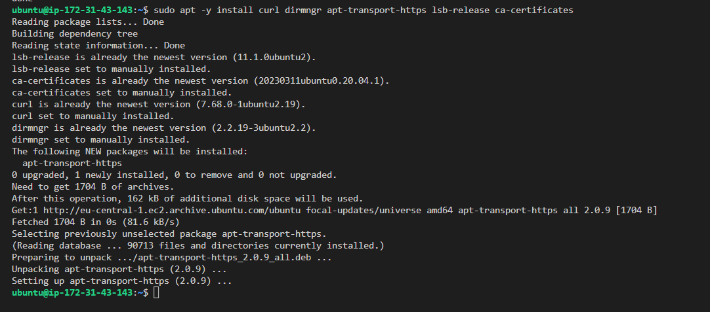

`curl -sL https://deb.nodesource.com/setup_18.x | sudo -E bash -`

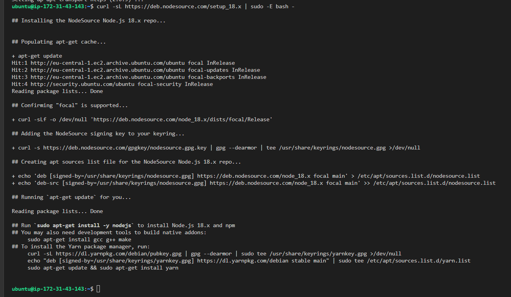

install nodejs

`sudo apt install -y nodejs`

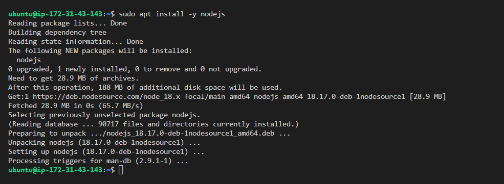

### INSTALL MONGODB

MongoDB stores data in flexible, JSON-like documents. Fields in a database can vary from document to document and data structure can be changed over time. For our example application, we are adding book records to MongoDB that contain book name, isbn number, author, and number of pages.

Import the Public Key used by Package Management System

`sudo apt-get install gnupg curl`

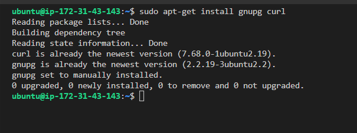

`curl -fsSL https://pgp.mongodb.com/server-6.0.asc | sudo gpg -o /usr/share/keyrings/mongodb-server-6.0.gpg --dearmor`

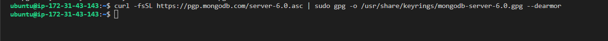

Create a list file for MONGODB

FOR UBUNTU 20.04

`echo "deb [ arch=amd64,arm64 signed-by=/usr/share/keyrings/mongodb-server-6.0.gpg ] https://repo.mongodb.org/apt/ubuntu focal/mongodb-org/6.0 multiverse" | sudo tee /etc/apt/sources.list.d/mongodb-org-6.0.list`

FOR UBUNTU 22.04

`echo "deb [ arch=amd64,arm64 signed-by=/usr/share/keyrings/mongodb-server-6.0.gpg ] https://repo.mongodb.org/apt/ubuntu jammy/mongodb-org/6.0 multiverse" | sudo tee /etc/apt/sources.list.d/mongodb-org-6.0.list`

We are using UBUNTU 20.04

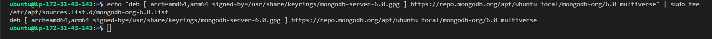

Reload local packages

`sudo apt-get update`

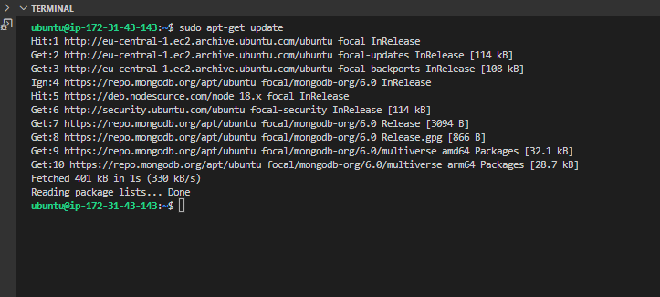

Install MongoDB

`sudo apt-get install -y mongodb-org`

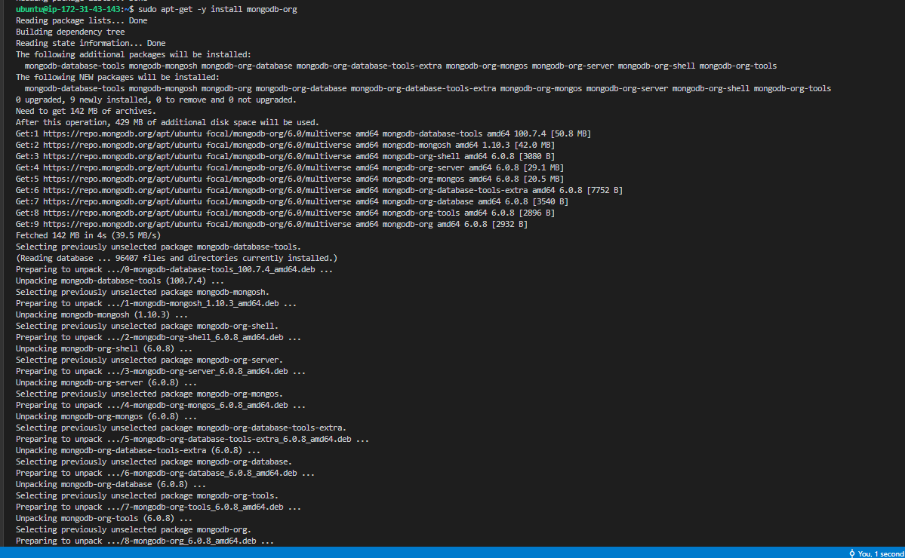

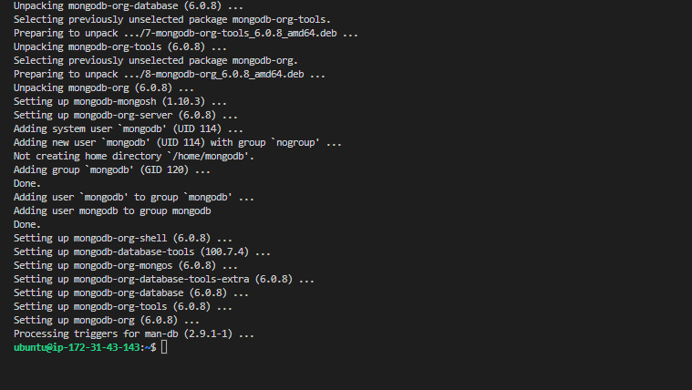

Start and enable mongoDB service

`sudo systemctl start mongod`

`sudo systemctl enable mongod`

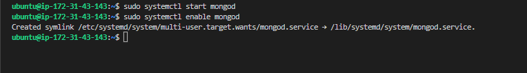

Verify that MongoDB service is up and running

`sudo systemctl status mongod`

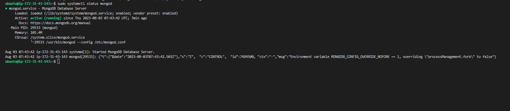

Install body-parser package

We need ‘body-parser’ package to help us process JSON files passed in requests to the server

`sudo npm install body-parser`

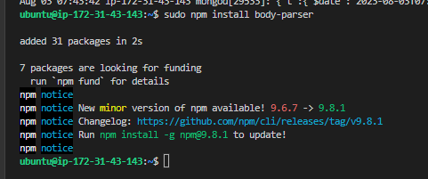

Create a folder named ‘Books’ and cd into Books

`mkdir Books && cd Books`

In the books directory, Initialise npm project

`npm init`

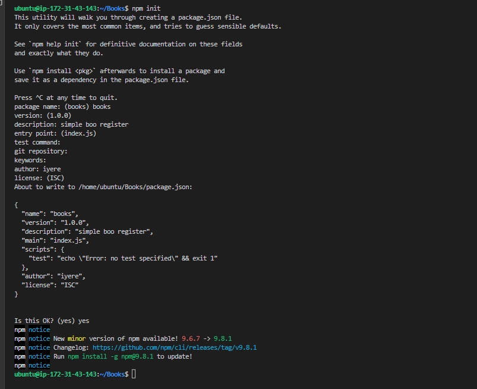

Add file named srever.js and paste configuration below:

var express = require('express');
var bodyParser = require('body-parser');
var app = express();
app.use(express.static(__dirname + '/public'));
app.use(bodyParser.json());
require('./apps/routes')(app);
app.set('port', 3300);
app.listen(app.get('port'), function() {
    console.log('Server up: http://localhost:' + app.get('port'));
});

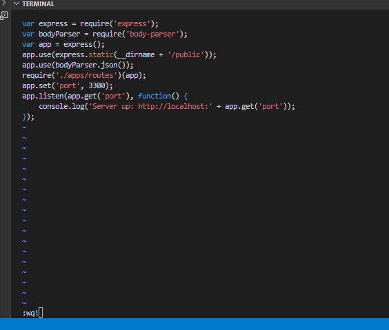

`vi server,js`

