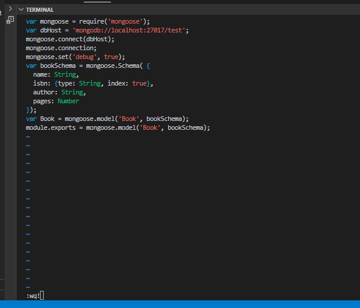

#  implementing a simple Book Register web form using MEAN stack
## INSTALL NODEJS

Node.js is a JavaScript runtime built on Chrome’s V8 JavaScript engine. Node.js is used in this tutorial to set up the Express routes and AngularJS controllers.

update ubuntu

`sudo apt update`

upgrade ubuntu

`sudo apt upgrade -y`

Add certificates

`sudo apt -y install curl dirmngr apt-transport-https lsb-release ca-certificates`

`curl -sL https://deb.nodesource.com/setup_18.x | sudo -E bash -`

install nodejs

`sudo apt install -y nodejs`

### INSTALL MONGODB

MongoDB stores data in flexible, JSON-like documents. Fields in a database can vary from document to document and data structure can be changed over time. For our example application, we are adding book records to MongoDB that contain book name, isbn number, author, and number of pages.

Import the Public Key used by Package Management System

`sudo apt-get install gnupg curl`

`curl -fsSL https://pgp.mongodb.com/server-6.0.asc | sudo gpg -o /usr/share/keyrings/mongodb-server-6.0.gpg --dearmor`

Create a list file for MONGODB

FOR UBUNTU 20.04

`echo "deb [ arch=amd64,arm64 signed-by=/usr/share/keyrings/mongodb-server-6.0.gpg ] https://repo.mongodb.org/apt/ubuntu focal/mongodb-org/6.0 multiverse" | sudo tee /etc/apt/sources.list.d/mongodb-org-6.0.list`

FOR UBUNTU 22.04

`echo "deb [ arch=amd64,arm64 signed-by=/usr/share/keyrings/mongodb-server-6.0.gpg ] https://repo.mongodb.org/apt/ubuntu jammy/mongodb-org/6.0 multiverse" | sudo tee /etc/apt/sources.list.d/mongodb-org-6.0.list`

We are using UBUNTU 20.04

Reload local packages

`sudo apt-get update`

Install MongoDB

`sudo apt-get install -y mongodb-org`

Start and enable mongoDB service

`sudo systemctl start mongod`

`sudo systemctl enable mongod`

Verify that MongoDB service is up and running

`sudo systemctl status mongod`

Install body-parser package

We need ‘body-parser’ package to help us process JSON files passed in requests to the server

`sudo npm install body-parser`

Create a folder named ‘Books’ and cd into Books

`mkdir Books && cd Books`

In the books directory, Initialise npm project

`npm init`

Add file named srever.js and paste configuration below:

var express = require('express');
var bodyParser = require('body-parser');
var app = express();
app.use(express.static(__dirname + '/public'));
app.use(bodyParser.json());
require('./apps/routes')(app);
app.set('port', 3300);
app.listen(app.get('port'), function() {
    console.log('Server up: http://localhost:' + app.get('port'));
});

`vi server.js`

INSTALL EXPRESS AND SET UP ROUTES TO THE SERVER

Express is a minimal and flexible Node.js web application framework that provides features for web and mobile applications. We will use Express to pass book information to and from our MongoDB database.

We also will use Mongoose package which provides a straight-forward, schema-based solution to model your application data. We will use Mongoose to establish a schema for the database to store data of our book register

`sudo npm install express mongoose`

In Books folder, create  a folder named apps and change directory to apps

`mkdir apps && cd apps`

Create a file named routes.js and copy and paste file below into it:

const Book = require('./models/book');

module.exports = function(app){
  app.get('/book', function(req, res){
    Book.find({}).then(result => {
      res.json(result);
    }).catch(err => {
      console.error(err);
      res.status(500).send('An error occurred while retrieving books');
    });
  });

  app.post('/book', function(req, res){
    const book = new Book({
      name: req.body.name,
      isbn: req.body.isbn,
      author: req.body.author,
      pages: req.body.pages
    });
    book.save().then(result => {
      res.json({
        message: "Successfully added book",
        book: result
      });
    }).catch(err => {
      console.error(err);
      res.status(500).send('An error occurred while saving the book');
    });
  });

  app.delete("/book/:isbn", function(req, res){
    Book.findOneAndRemove(req.query).then(result => {
      res.json({
        message: "Successfully deleted the book",
        book: result
      });
    }).catch(err => {
      console.error(err);
      res.status(500).send('An error occurred while deleting the book');
    });
  });

  const path = require('path');
  app.get('*', function(req, res){
    res.sendFile(path.join(__dirname, 'public', 'index.html'));
  });
};

`vi routes.js`

in apps folder, create a folder named models and cd into models

`mkdir models && cd models`

create a file named book.js then copy and paste code below into it:

var mongoose = require('mongoose');
var dbHost = 'mongodb://localhost:27017/test';
mongoose.connect(dbHost);
mongoose.connection;
mongoose.set('debug', true);
var bookSchema = mongoose.Schema( {
  name: String,
  isbn: {type: String, index: true},
  author: String,
  pages: Number
});
var Book = mongoose.model('Book', bookSchema);
module.exports = mongoose.model('Book', bookSchema);

`vi books.js`

ACCESS THE routes WITH AngularJS

AngularJS provides a web framework for creating dynamic views in your web applications. In this tutorial, we use AngularJS to connect our web page with Express and perform actions on our book register.

Change the directory back to ‘Books’

`cd ../..`

Create a folder named 'public' and cd into 'public'

`mkdir public && cd public`

Add file named script.js and paste code below (controller configuration defined) into it:

var app = angular.module('myApp', []);
app.controller('myCtrl', function($scope, $http) {
  $http( {
    method: 'GET',
    url: '/book'
  }).then(function successCallback(response) {
    $scope.books = response.data;
  }, function errorCallback(response) {
    console.log('Error: ' + response);
  });
  $scope.del_book = function(book) {
    $http( {
      method: 'DELETE',
      url: '/book/:isbn',
      params: {'isbn': book.isbn}
    }).then(function successCallback(response) {
      console.log(response);
    }, function errorCallback(response) {
      console.log('Error: ' + response);
    });
  };
  $scope.add_book = function() {
    var body = '{ "name": "' + $scope.Name + 
    '", "isbn": "' + $scope.Isbn +
    '", "author": "' + $scope.Author + 
    '", "pages": "' + $scope.Pages + '" }';
    $http({
      method: 'POST',
      url: '/book',
      data: body
    }).then(function successCallback(response) {
      console.log(response);
    }, function errorCallback(response) {
      console.log('Error: ' + response);
    });
  };
});

`vi script.js`

In public folder, create a file named index.html and paste code below into it:

<!doctype html>
<html ng-app="myApp" ng-controller="myCtrl">
  <head>
    
    
  </head>
  <body>
    

      <table>
        <tr>
          <td>Name:</td>
          <td><input type="text" ng-model="Name"></td>
        </tr>
        <tr>
          <td>Isbn:</td>
          <td><input type="text" ng-model="Isbn"></td>
        </tr>
        <tr>
          <td>Author:</td>
          <td><input type="text" ng-model="Author"></td>
        </tr>
        <tr>
          <td>Pages:</td>
          <td><input type="number" ng-model="Pages"></td>
        </tr>
      </table>
      <button ng-click="add_book()">Add</button>
    

    

    

      <table>
        <tr>
          <th>Name</th>
          <th>Isbn</th>
          <th>Author</th>
          <th>Pages</th>

        </tr>
        <tr ng-repeat="book in books">
          <td>{{book.name}}</td>
          <td>{{book.isbn}}</td>
          <td>{{book.author}}</td>
          <td>{{book.pages}}</td>

          <td><input type="button" value="Delete" data-ng-click="del_book(book)"></td>
        </tr>
      </table>
    

  </body>
</html>

`vi index.html`

Change back to Books directory

`cd ..`

start server by running command below:

`node server.js`

The server is now up and running, we can connect it via port 3300. You can launch a separate Putty or SSH console to test what curl command returns locally.

`curl -s http://localhost:3300`

Open TCP port 3300 in AWS console to be able to access url vis browser

Access book reister app in browser

END OF PROJECT!
